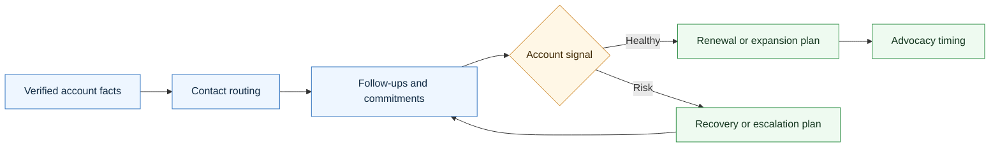
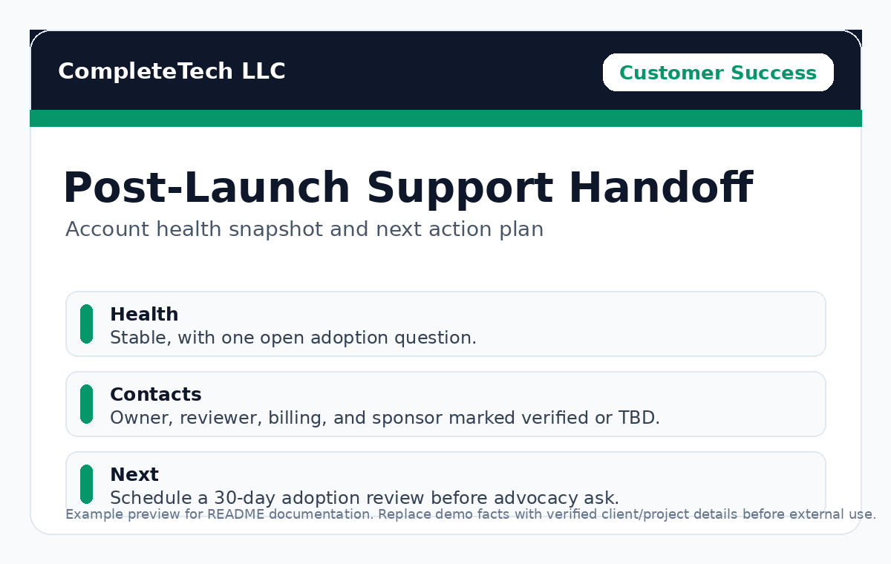

# Agentic Customer Success Skill

<p align="center">
  
</p>

A CompleteTech LLC Codex skill for creating customer success and account management artifacts for agentic development clients.

## About

Part of the CompleteTech LLC agentic services skill library. This skill keeps post-contact and post-sale client relationships organized through verified routing, follow-up, health, renewal, expansion, and advocacy artifacts.

## OpenClaw / ClawHub Metadata

- Skill key: `agentic-customer-success-skill`
- Version-ready metadata: `1.0.0`
- Homepage: https://github.com/CompleteTech-LLC/agentic-customer-success-skill
- README: https://github.com/CompleteTech-LLC/agentic-customer-success-skill#readme
- Runtime binaries: `python3`
- Python packages: none
- Intended registry/discovery tags: `latest`, `complete-tech`, `codex-skill`, `agentic-development`, `agentic-workflows`, `customer-success`, `account-management`, `renewal`
- License: repository code, templates, and documentation use MIT; ClawHub publishing is intentionally skipped for now.
- Brand assets: CompleteTech LLC names, logos, seals, and brand assets are reserved; see `BRAND_ASSETS.md`.

## Workflow Diagram



## What It Does

- Selects the right customer success artifact by customer situation, account stage, relationship risk, contact-routing need, support issue, renewal timing, or expansion opportunity.
- Drafts account profiles, contact maps, routing guides, meeting notes, follow-up trackers, health scorecards, relationship risk logs, renewal reviews, expansion briefs, QBRs, support escalation summaries, satisfaction surveys, referral/testimonial request plans, executive check-ins, at-risk recovery plans, offboarding checklists, stakeholder change notes, cadence plans, success criteria reviews, and adoption check-ins.
- Keeps customer management focused on verified facts, clear ownership, practical next steps, and appropriate human review.
- Helps agents avoid missed follow-ups, wrong-contact messages, invented sentiment, unsupported renewal assumptions, and premature testimonial/referral requests.

## Contents

- `SKILL.md` - operating instructions and artifact-selection guide.
- `references/customer-success-catalog.md` - reusable customer success artifact templates.
- `references/use-case-decision-table.md` - quick guide for choosing the right artifact.
- `references/customer-success-lifecycle.md` - flow from first contact through delivery, launch, renewal, expansion, or offboarding.
- `references/customer-success-positioning.md` - CompleteTech LLC language, contact routing, and guardrails.
- `references/template-index.json` - machine-readable artifact metadata.
- `scripts/render_customer_success.py` - deterministic artifact listing and rendering helper.

## Quick Start

```bash
python3 scripts/render_customer_success.py --list
python3 scripts/render_customer_success.py \
  --template client-account-profile \
  --var client_name=Acme \
  --var workflow="support triage agent"
```

Rendered artifacts are drafts. Replace placeholders with verified account, contact, communication, delivery, support, renewal, and approval facts before use.

## Example



**Account health snapshot: Post-launch support handoff**

```bash
python3 scripts/render_customer_success.py \
  --template client-health-scorecard \
  --var client_name="Northstar Support" \
  --var workflow="support triage agent" \
  --var account_stage="post-launch support" \
  --var success_criteria="reviewer confidence, stable escalation routing, weekly queue visibility" \
  --var next_action="schedule 30-day adoption review"
```

Example output focus:

- Health: stable, with one open adoption question.
- Contacts: delivery owner, technical reviewer, billing contact, and executive sponsor marked as verified or `TBD`.
- Next step: confirm adoption signals before asking for a testimonial or expansion conversation.

## Brand Notes

Use a practical, direct, professional tone. Customer success artifacts should help CompleteTech LLC keep client relationships organized: know the contacts, route messages correctly, track commitments, surface risks early, confirm success criteria, and ask for referrals or testimonials only with verified approval. Do not invent client facts, customer sentiment, approvals, renewal intent, testimonials, referrals, email addresses, or business outcomes.

## License

Code, templates, and documentation are licensed under the MIT License. CompleteTech LLC names, logos, seals, and brand assets are reserved and are not licensed for reuse except to identify this project. See `LICENSE` and `BRAND_ASSETS.md`.
